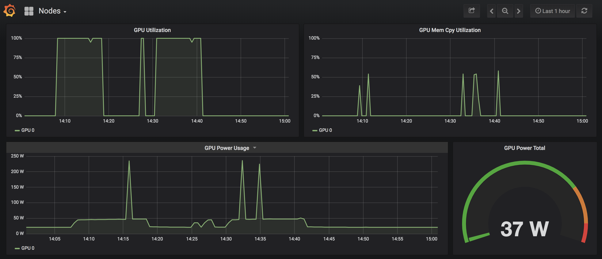

# Demo: GPU enabled Kubernetes cluster running on Oracle Cloud Infrastructure and Microsoft Azure using the interconnect

The demos in this guide uses a cross-cloud, GPU enabled Kubernetes cluster running on Oracle Cloud Infrastructure and Microsoft Azure using the interconnect that is already deployed.

If you want to deploy the same cluster on your own after the event, you can follow the steps [in this guide](https://github.com/OguzPastirmaci/kubernetes-oci-azure-interconnect).

- You can check the browser tab named [**Kubernetes Operational View**](http://132.145.154.251:31167/) to see the pods being created/deleted in the cluster.


- You can also check the browser tab named [**Grafana**](http://132.145.154.251:30902/d/Q4B_KPJWk/nodes?orgId=1) to see GPU monitoring metrics.




**NOTE:** The user you have right to deploy to the `supercomputing19` namespace in the Kubernetes cluster. If you get an error message saying you are not authorized, check that you are doing an operation in the `supercomputing19` namespace.

## 1. Running `nvidia-smi` on Kubernetes worker nodes

**IMPORTANT**: You should run all of the commands in this guide in the iTerm2 terminal in the Dock. It should already be logged in to the bastion instance and show `[opc@sc19 ~]$`. If not, simply SSH into the bastion using the following command:

```console
ssh opc@129.213.105.35
```

Let's start with running a very simple pod that shows the output of the `nvidia-smi` command in our Kubernetes cluster.

### Running `nvidia-smi` on OCI

The worker nodes in Kubernetes are already labeled depending on the cloud they are running (worker in OCI has the `cloud: oci` label, and worker in Azure has the `cloud: azure` label. As you can see from the command, we will be selecting the nodes using this labels. You can also run the same with a yaml file.

```console
kubectl run oci-gpu-test --namespace supercomputing19 --rm -t -i --restart=Never --image=nvidia/cuda:10.1-base --limits=nvidia.com/gpu=1 --overrides='{"apiVersion": "v1", "spec": {"nodeSelector": { "cloud": "oci" }}}' -- nvidia-smi
```
You should see an output like below. Note that the VM on OCI has a **Nvidia Tesla V100** GPU.

```console
Mon Nov 18 19:58:37 2019
+-----------------------------------------------------------------------------+
| NVIDIA-SMI 435.21       Driver Version: 435.21       CUDA Version: 10.1     |
|-------------------------------+----------------------+----------------------+
| GPU  Name        Persistence-M| Bus-Id        Disp.A | Volatile Uncorr. ECC |
| Fan  Temp  Perf  Pwr:Usage/Cap|         Memory-Usage | GPU-Util  Compute M. |
|===============================+======================+======================|
|   0  Tesla V100-SXM2...  Off  | 00000000:00:04.0 Off |                    0 |
| N/A   34C    P0    20W / 300W |      0MiB / 16160MiB |      0%      Default |
+-------------------------------+----------------------+----------------------+

+-----------------------------------------------------------------------------+
| Processes:                                                       GPU Memory |
|  GPU       PID   Type   Process name                             Usage      |
|=============================================================================|
|  No running processes found                                                 |
+-----------------------------------------------------------------------------+
```

### Running `nvidia-smi` on Azure

Now let's run the same command in Azure. This time we will select the node that has `cloud: azure` as the label:
```console
kubectl run azure-gpu-test --namespace supercomputing19 --rm -t -i --restart=Never --image=nvidia/cuda:10.1-base --limits=nvidia.com/gpu=1 --overrides='{"apiVersion": "v1", "spec": {"nodeSelector": { "cloud": "azure" }}}' -- nvidia-smi
```

You should see an output like below. Note that the VM on Azure has a **Nvidia Tesla K80** GPU.

```console
Mon Nov 18 20:02:28 2019
+-----------------------------------------------------------------------------+
| NVIDIA-SMI 435.21       Driver Version: 435.21       CUDA Version: 10.1     |
|-------------------------------+----------------------+----------------------+
| GPU  Name        Persistence-M| Bus-Id        Disp.A | Volatile Uncorr. ECC |
| Fan  Temp  Perf  Pwr:Usage/Cap|         Memory-Usage | GPU-Util  Compute M. |
|===============================+======================+======================|
|   0  Tesla K80           Off  | 0000D43D:00:00.0 Off |                    0 |
| N/A   39C    P8    33W / 149W |      0MiB / 11441MiB |      1%      Default |
+-------------------------------+----------------------+----------------------+

+-----------------------------------------------------------------------------+
| Processes:                                                       GPU Memory |
|  GPU       PID   Type   Process name                             Usage      |
|=============================================================================|
|  No running processes found                                                 |
+-----------------------------------------------------------------------------+
```

## 2. Running a Tensorflow job
In this step, we will run a simple MNIST classifier which displays summaries as a Tensorflow job. The job will run on a single node, so it is not distributed.

Here's the configuration we will be running:

```yaml
apiVersion: kubeflow.org/v1
kind: TFJob
metadata:
  name: tf-mnist
spec:
  CleanPodPolicy: All
  tfReplicaSpecs:
    MASTER:
      replicas: 1
      template:
        spec:
          containers:
            - image: oguzpastirmaci/tf-mnist:gpu
              name: tensorflow
              resources:
                limits:
                  nvidia.com/gpu: 1
          restartPolicy: OnFailure
```

1. Let's run the Tensorflow job with the following command:
```console
kubectl create -n supercomputing19 -f https://raw.githubusercontent.com/OguzPastirmaci/sc19/master/examples/tf-mnist.yaml
```

**NOTE:** If you receive an error message saying `Error from server (AlreadyExists): error when creating "https://raw.githubusercontent.com/OguzPastirmaci/sc19/master/examples/tf-mnist.yaml": tfjobs.kubeflow.org "tf-mnist" already exists`, run the following command to delete the existing job, and rerun the previous command again:

```console
kubectl delete -n supercomputing19 -f https://raw.githubusercontent.com/OguzPastirmaci/sc19/master/examples/tf-mnist.yaml
```

2. Now run the following command to get the logs from the job:

```console
kubectl logs tf-mnist-master-0 -f -n supercomputing19
```

You should be seeing the logs. It will take about a minute for the job to complete.

```console
...
2019-11-18 20:40:19.436071: I tensorflow/stream_executor/platform/default/dso_loader.cc:44] Successfully opened dynamic library libcudart.so.10.0
2019-11-18 20:40:19.437862: I tensorflow/stream_executor/platform/default/dso_loader.cc:44] Successfully opened dynamic library libcublas.so.10.0
2019-11-18 20:40:19.439410: I tensorflow/stream_executor/platform/default/dso_loader.cc:44] Successfully opened dynamic library libcufft.so.10.0
...
Adding run metadata for 899
Accuracy at step 900: 0.9655
Accuracy at step 910: 0.965
Accuracy at step 920: 0.9662
Accuracy at step 930: 0.9689
Accuracy at step 940: 0.9684
Accuracy at step 950: 0.9676
Accuracy at step 960: 0.9679
Accuracy at step 970: 0.968
Accuracy at step 980: 0.9683
Accuracy at step 990: 0.969
Adding run metadata for 999
```

3. After you check the logs, delete the job with the following command:

```console
kubectl delete -n supercomputing19 -f https://raw.githubusercontent.com/OguzPastirmaci/sc19/master/examples/tf-mnist.yaml
```

## 2. Running a Tensorflow job

In this step, you will launch a multi-node TensorFlow MPI benchmark training job. The job will start a launcher and then 2 workers, 1 on OCI and 1 on Azure.

Here's the configuration we will be running:

```yaml
apiVersion: kubeflow.org/v1alpha2
kind: MPIJob
metadata:
  name: tensorflow-benchmarks
spec:
  slotsPerWorker: 1
  cleanPodPolicy: Running
  mpiReplicaSpecs:
    Launcher:
      replicas: 1
      template:
         spec:
           containers:
           - image: mpioperator/tensorflow-benchmarks:latest
             name: tensorflow-benchmarks
             command:
             - mpirun
             - --allow-run-as-root
             - -np
             - "2"
             - -bind-to
             - none
             - -map-by
             - slot
             - -x
             - NCCL_DEBUG=INFO
             - -x
             - LD_LIBRARY_PATH
             - -x
             - PATH
             - -mca
             - pml
             - ob1
             - -mca
             - btl
             - ^openib
             - python
             - scripts/tf_cnn_benchmarks/tf_cnn_benchmarks.py
             - --model=resnet101
             - --batch_size=64
             - --variable_update=horovod
    Worker:
      replicas: 2
      template:
        spec:
          containers:
          - image: mpioperator/tensorflow-benchmarks:latest
            name: tensorflow-benchmarks
            resources:
              limits:
                nvidia.com/gpu: 1
```

1. Run the following command to start the MPI job:

```console
kubectl create -n supercomputing19 -f https://raw.githubusercontent.com/OguzPastirmaci/sc19/master/examples/tensorflow-benchmarks.yaml
```

2. Training will run for 100 steps and takes a few minutes on a GPU cluster. You can inspect the logs to see the training progress. When the job starts, access the logs from the launcher pod:

```console
PODNAME=$(kubectl get pods -n supercomputing19 -l mpi_job_name=tensorflow-benchmarks,mpi_role_type=launcher -o name)
```

```console
kubectl logs -n supercomputing19 -f ${PODNAME}
```

You should be seeing the logs. It will take several minutes for the job to complete. You can always `CTRL+C` to quit seeing the logs.

```console
...
TensorFlow:  1.14
Model:       resnet101
Dataset:     imagenet (synthetic)
Mode:        training
SingleSess:  False
Batch size:  128 global
             64 per device
Num batches: 100
Num epochs:  0.01
Devices:     ['horovod/gpu:0', 'horovod/gpu:1']
NUMA bind:   False
Data format: NCHW
Optimizer:   sgd
Variables:   horovod

...

Step	Img/sec	total_loss
1	images/sec: 11.8 +/- 0.0 (jitter = 0.0)	8.327
1	images/sec: 11.8 +/- 0.0 (jitter = 0.0)	8.352
10	images/sec: 11.1 +/- 0.2 (jitter = 0.3)	8.504
10	images/sec: 11.1 +/- 0.2 (jitter = 0.3)	8.539
20	images/sec: 11.1 +/- 0.1 (jitter = 0.5)	8.299
20	images/sec: 11.1 +/- 0.1 (jitter = 0.5)	8.511
30	images/sec: 11.0 +/- 0.1 (jitter = 0.4)	8.331
30	images/sec: 11.0 +/- 0.1 (jitter = 0.4)	8.284
40	images/sec: 10.9 +/- 0.1 (jitter = 0.4)	8.297
40	images/sec: 10.9 +/- 0.1 (jitter = 0.4)	8.462
50	images/sec: 10.9 +/- 0.1 (jitter = 0.3)	8.436
50	images/sec: 10.9 +/- 0.1 (jitter = 0.3)	8.388
60	images/sec: 10.9 +/- 0.1 (jitter = 0.3)	8.360
60	images/sec: 10.9 +/- 0.1 (jitter = 0.4)	8.335
70	images/sec: 11.0 +/- 0.1 (jitter = 0.3)	8.435
70	images/sec: 11.0 +/- 0.1 (jitter = 0.3)	8.423
80	images/sec: 11.1 +/- 0.1 (jitter = 0.5)	8.203
80	images/sec: 11.1 +/- 0.1 (jitter = 0.4)	8.399
90	images/sec: 11.2 +/- 0.1 (jitter = 0.5)	8.443
90	images/sec: 11.2 +/- 0.1 (jitter = 0.5)	8.408
100	images/sec: 11.3 +/- 0.1 (jitter = 0.8)	8.541
----------------------------------------------------------------
total images/sec: 22.64
----------------------------------------------------------------
100	images/sec: 11.3 +/- 0.1 (jitter = 0.7)	8.370
----------------------------------------------------------------
total images/sec: 22.64
----------------------------------------------------------------
```


